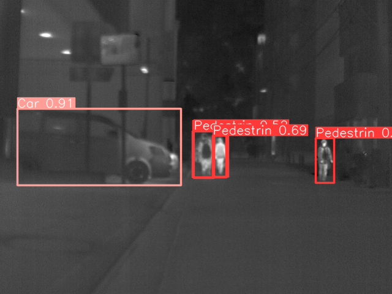

# Multi-spectral Object Detection dataset

**2D object detection of Multi-spectral Object Detection dataset using pretrained yolov8**

## Dataset

Multispectral images composed of RGB images, near-infrared images, middle-infrared images, and far-infrared images

https://www.mi.t.u-tokyo.ac.jp/static/projects/mil_multispectral/

## Yolov8

Ultralytics YOLOv8 is a cutting-edge, state-of-the-art (SOTA) model that builds upon the success of previous YOLO versions and introduces new features and improvements to further boost performance and flexibility. YOLOv8 is designed to be fast, accurate, and easy to use, making it an excellent choice for a wide range of object detection and tracking, instance segmentation, image classification and pose estimation tasks.

In the project a model pretrained on COCO dataset is used

https://github.com/ultralytics/ultralytics

## Results

